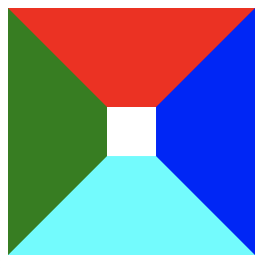
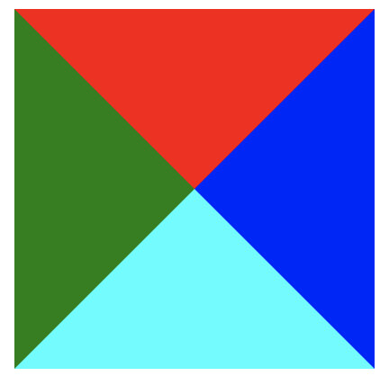
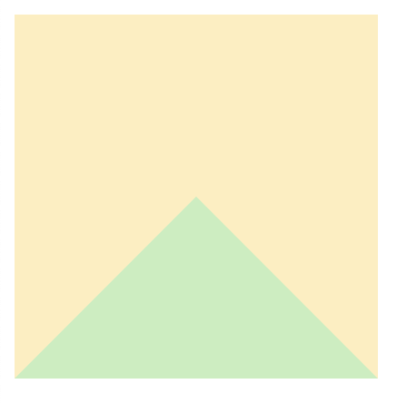
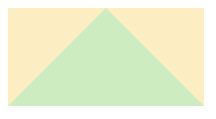
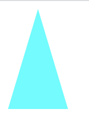
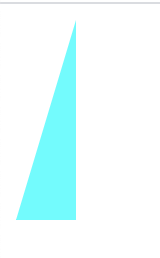

# 利用div+css画一个三角形
## 前言
本文利用了border来实现三角形的绘制，并且只能绘制填充颜色的三角，无法绘制带边框无填充颜色的三角形。
## 盒子模型
先来看一下盒子模型中的border，它有哪些特点

可以看出盒子模型中4个方向上的border是以对角线进行分割的
```css
    .triangle{
      border-color: red blue aqua green;
      border-width: 100px 100px 100px 100px;
      border-style: solid;
      width: 50px;
      height: 50px;
    }
```
```html
    <div class="triangle"></div>
```


## 把width和height都设置为0
如果把width和height都设置为0会是什么效果呢？

可以看出三角形已经出来了，接下来要去掉其他3个三角形，我们可以把它们的颜色设置为透明
```css
    .triangle{
      border-color: red blue aqua green;
      border-width: 100px 100px 100px 100px;
      border-style: solid;
      width: 0;
      height: 0;
    }
```
```html
  <div class="triangle"></div>
```

## 设置其他3个颜色为透明

可以看到只有1个三角形了，但是其他3个三角形的高度还在
```css
    .triangle{
      border-color: transparent transparent aqua transparent;
      border-width: 100px 100px 100px 100px;
      border-style: solid;
      width: 0;
      height: 0;
    }
```
```html
  <div class="triangle"></div>
```

## 修改border宽度

```css
    .triangle{
      border-color: transparent transparent aqua transparent;
      border-width: 0px 100px 100px 100px;
      border-style: solid;
      width: 0;
      height: 0;
    }
```


```css
    .triangle{
      border-color: transparent transparent aqua transparent;
      border-width: 0px 30px 100px 30px;
      border-style: solid;
      width: 0;
      height: 0;
    }
```


```css
    .triangle{
      border-color: transparent transparent aqua transparent;
      border-width: 0px 0px 100px 30px;
      border-style: solid;
      width: 0;
      height: 0;
    }
```