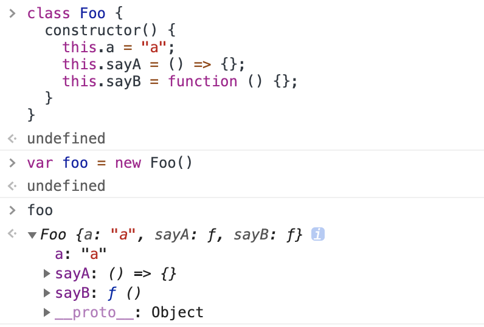
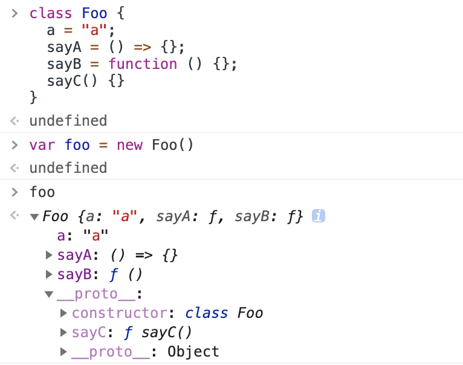

# 在 constructor 中定义

所有内容都定义在实例自身上


```javascript
class Foo {
  constructor() {
    this.a = "a";
    this.sayA = () => {};
    this.sayB = function () {};
  }
}
```

# 在 类块 中定义

a、sayA、sayB 都定义在实例自身上, sayC 定义在类的原型上


```javascript
class Foo {
  a = "a";
  sayA = () => {};
  sayB = function () {};
  sayC() {}
}
```
