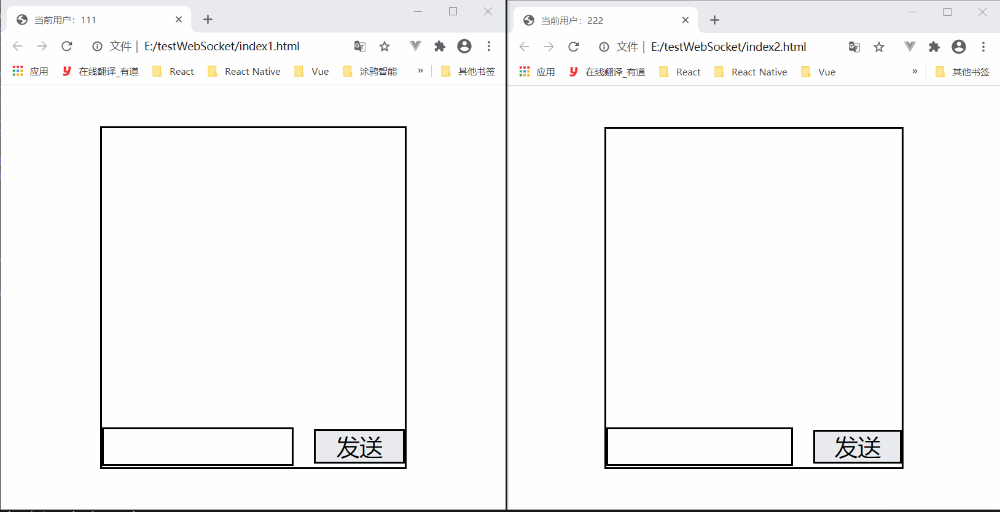

# 基于WebSocket实现即时通讯功能
最终效果  

[仓库地址](https://gitee.com/percent79/IM-FOR-WebSocket)  
服务器端语言选用了Node.js, 使用了[nodejs-websocket](https://www.npmjs.com/package/nodejs-websocket)包。  
**nodejs-websocket**是用于websocket服务器和客户端的Node.js模块。
### 服务器端代码
```javascript
const ws = require("nodejs-websocket");
console.log("开始建立连接...")

const queueItem = {
  userId: null,// 发起连接的userId
  targetId: null,// 连接目标的targetId
  userConn: null,// user连接对象
  targetConn: null,// target连接对象
  userReady: false,// userReady状态，可理解为在线状态
  targetReady: false,// targetReady状态，可理解为在线状态
}
const queue = [];

/**
 * 查找队列中是否已经存在该连接,返回下标
 * @param {*} userId 
 * @param {*} targetId 
 * @return {index OR -1}
 */
const findConnIndex = (userId, targetId) => {
  const index = queue.findIndex(item => (
    (item.userId === userId && item.targetId === targetId)
    || (item.userId === targetId && item.targetId === userId)
  ));
  return index;
}

const server = ws.createServer((conn) => {
  conn.on("text", (str) => {
    let data = {};
    try {
      data = JSON.parse(str);
    } catch (error) {
    }
    const { userId, targetId, message } = data;
    const connInex = findConnIndex(userId, targetId);
    if (connInex === -1) {
      console.log('队列中不存在')
      // 发起用户和目标用户不在队列中，则添加到队列中
      queue.push({
        userId,
        targetId,
        userConn: conn,
        targetConn: null,
        userReady: false,
        targetReady: false,
      })
    } else {
      // 如果已经在队列中
      // 判断当前发送信息的是队列中的user还是target
      if (userId === queue[connInex].userId && targetId === queue[connInex].targetId) {
        // 队列中的userId和当前发送消息的用户userId一致
        queue[connInex].userReady = true;
        queue[connInex].userConn = conn;
      }
      if (userId === queue[connInex].targetId && targetId === queue[connInex].userId) {
        // 队列中的targetId和当前发送消息的用户userId一致
        queue[connInex].targetReady = true;
        queue[connInex].targetConn = conn;
      }
      if (message !== undefined) {
        const data = JSON.stringify({
          id: userId,
          msg: message,
        });
        if (queue[connInex].userReady) {
          queue[connInex].userConn.sendText(data);
        }
        if (queue[connInex].targetReady) {
          queue[connInex].targetConn.sendText(data);
        }
      }
    }
  })

  conn.on("close", (code, reason) => {
    console.log("关闭连接")
  });

  conn.on("error", (code, reason) => {
    console.log("异常关闭")
  });
}).listen(8001);
console.log("WebSocket服务开启成功")
```
### 客户端（用户111）代码
```html
<!doctype html>
<html lang="en">

<head>
  <meta charset="UTF-8">
  <title>当前用户：111</title>
  <link rel="stylesheet" href="style.css">
</head>

<body>
  <div id="app">
    <div id="msg"></div>
    <div class="footer">
      <input type="text" class="textInput">
      <button class="sendBtn">发送</button>
    </div>
  </div>

  <script>
    const userId = '111';
    const targetId = '222';
    const msgDom = document.getElementById("msg");
    const input = document.querySelector(".textInput");
    const btn = document.querySelector(".sendBtn");
    if (window.WebSocket) {
      var ws = new WebSocket('ws://127.0.0.1:8001');
      btn.onclick = async () => {
        const data = {
          userId,
          targetId,
          message: userId + ": “" + input.value + "”",
        }
        await ws.send(JSON.stringify(data));
        input.value = "";
      }
      ws.onopen = (e) => {
        const data = {
          userId,
          targetId,
        }
        ws.send(JSON.stringify(data));
      }
      ws.onclose = (e) => {
        console.log("服务器关闭");
      }
      ws.onerror = () => {
        console.log("连接出错");
      }
      ws.onmessage = (e) => {
        const res = JSON.parse(e.data);
        const {
          id,
          msg
        } = res;
        const msgItem = document.createElement("div");
        msgItem.innerHTML = msg;
        if (userId === id) {
          msgItem.classList.add("textRight");
        } else {
          msgItem.classList.add("textLeft");
        }
        msgDom.appendChild(msgItem);
      }
    }
  </script>
</body>

</html>
```

### 客户端（用户222）代码
```html
<!doctype html>
<html lang="en">

<head>
  <meta charset="UTF-8">
  <title>当前用户：222</title>
  <link rel="stylesheet" href="style.css">
</head>

<body>
  <div id="app">
    <div id="msg"></div>
    <div class="footer">
      <input type="text" class="textInput">
      <button class="sendBtn">发送</button>
    </div>
  </div>

  <script>
    const userId = '222';
    const targetId = '111';
    const msgDom = document.getElementById("msg");
    const input = document.querySelector(".textInput");
    const btn = document.querySelector(".sendBtn");
    if (window.WebSocket) {
      var ws = new WebSocket('ws://127.0.0.1:8001');
      btn.onclick = async () => {
        const data = {
          userId,
          targetId,
          message: userId + ": “" + input.value + "”",
        }
        await ws.send(JSON.stringify(data));
        input.value = "";
      }
      ws.onopen = (e) => {
        const data = {
          userId,
          targetId,
        }
        ws.send(JSON.stringify(data));
      }
      ws.onclose = (e) => {
        console.log("服务器关闭");
      }
      ws.onerror = () => {
        console.log("连接出错");
      }
      ws.onmessage = (e) => {
        const res = JSON.parse(e.data);
        const {
          id,
          msg
        } = res;
        const msgItem = document.createElement("div");
        msgItem.innerHTML = msg;
        if (userId === id) {
          msgItem.classList.add("textRight");
        } else {
          msgItem.classList.add("textLeft");
        }
        msgDom.appendChild(msgItem);
      }
    }
  </script>
</body>

</html>
```

### 样式代码
```css
html,
body {
    width: 100%;
    height: 100%;
    padding: 0;
    margin: 0;
    display: flex;
    align-items: center;
    justify-content: center;
    min-width: 400px;
}

#app {
    width: 60%;
    height: 80%;
    border: 2px solid #000;
    display: flex;
    flex-direction: column;
    justify-content: space-between;
    align-items: center;
}

.footer {
    width: 100%;
    height: 10vh;
    padding: 0;
    margin: 0;
    box-sizing: border-box;
    display: flex;
    flex-direction: row;
    justify-content: space-between;
    align-items: center;
}

.textInput {
    width: 60%;
    height: 80%;
    margin: 0;
    padding-left: 1vw;
    font-size: larger;
    border: 2px solid #000;
}

.sendBtn {
    width: 30%;
    height: 80%;
    padding: 0;
    margin: 0;
    border: 2px solid #000;
    font-size: 30px;
}

#msg {
    width: 100%;
    padding: 10px 20px;
    box-sizing: border-box;
}

#msg>div{
    font-size: 35px;
}

.textLeft {
    text-align: left;
}

.textRight {
    text-align: right;
}
```

### 前言
这个DEMO可以实现多个用户同时通信，但是只能进行在线通信，也就是说没有接收离线消息这个功能。